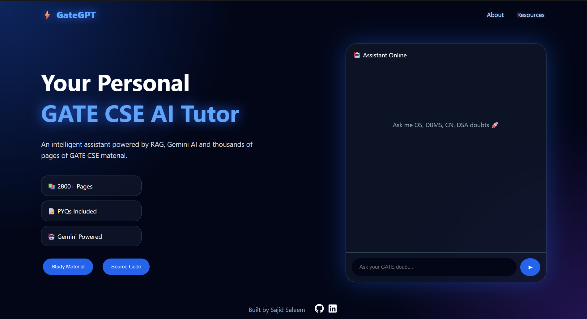
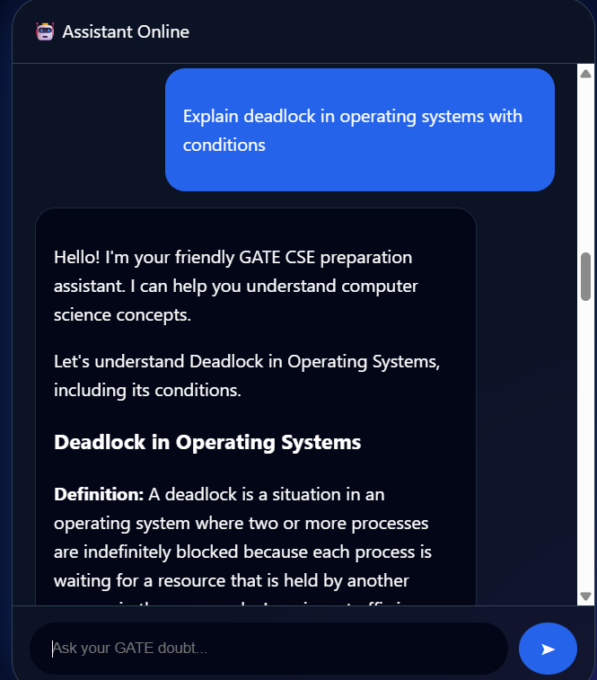
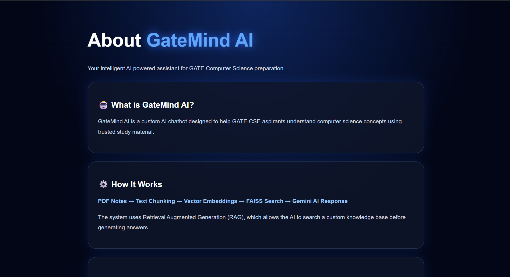

# GateGPT 🎓🤖

**GateGPT** is an AI-powered Retrieval Augmented Generation (RAG) chatbot designed specifically for **GATE Computer Science Engineering (CSE) aspirants**.  
It allows users to ask questions related to GATE CSE subjects and provides intelligent, context-aware answers using a custom-built knowledge base.

GateGPT follows an Agentic Retrieval-Augmented Generation (Agentic RAG) architecture. A Supervisor Agent classifies user intent and routes queries to specialized agents that retrieve knowledge from a curated GATE CSE knowledge base before generating grounded responses with Gemini AI. A Verification Agent then validates the generated answer against the retrieved context to minimize hallucinations and improve reliability.

---

## 🚀 Features

- 🤖 **Multi-Agent Agentic RAG Architecture**
- 🧠 **Supervisor Agent** for intelligent query routing.
- 📘 **Concept Agent** for books, notes, and solved papers.
- 📄 **PYQ Agent** for subject-wise and year-wise previous year questions.
- 📅 **Study Planner Agent** for personalized study plans.
- ✅ **Verification Agent** to reduce hallucinations by validating responses against retrieved context.
- 📚 **Metadata-Aware Knowledge Retrieval** using FAISS and semantic filtering.
- 🔎 **Semantic Search** powered by HuggingFace embeddings.
- 📄 **Multi-PDF Knowledge Ingestion** with automatic metadata generation.
- 📝 **Structured Markdown Responses** with explanations, examples, formulas, and GATE-oriented insights.
- 📌 **Source References** including original document names and page numbers.

---
## 📸 Screenshots

### 🏠 Home Page




### 🤖 GateGPT Chat Interface




### ℹ️ About Page


---

## 📊 Knowledge Base

GateGPT is built upon a curated GATE CSE knowledge base containing:

- 📄 **2882+ Pages**
- 🧩 **6546+ Semantic Chunks**
- 📚 Reference Books
- 📝 Subject Notes
- 📖 Solved Papers
- 📄 Subject-wise Previous Year Questions
- 📅 Year-wise Previous Year Questions

Every chunk contains metadata including:

- Document Type
- Category
- Source Document
- Page Number

allowing specialized agents to retrieve only domain-relevant information.
---

## 🏗️ System Architecture

GateGPT has been upgraded from a simple RAG chatbot to an **Autonomous Multi-Agent GATE CSE AI Mentor** ecosystem.

```
       User Question
             |
             v
      React Frontend
             |
             v
       Flask REST API
             |
             v
      Supervisor Agent (Intent Router)
             |
     +-------+-------+
     |       |       |
     v       v       v
  Concept   PYQ   Planner
   Agent   Agent   Agent
     |       |       |
     |       |       +---------------+
     v       v                       |
Retrieval  PYQ                       |
  Tool    Tool                       |
     |       |                       |
     v       v                       |
   FAISS Vector DB                   |
     \       /                       |
      v     v                        |
  Generated Response                 |
           \                         /
            v                       v
          Verification Agent (Anti-Hallucination)
                         |
                         v
                Final Verified Answer
```

---

## 🛠️ Tech Stack

### Frontend

- React.js
- Vite
- Axios
- React Markdown
- CSS3 (Glassmorphism UI)

### Backend

- Python
- Flask
- LangChain
- Google Gemini API
- HuggingFace Embeddings
- FAISS Vector Database

### AI / Machine Learning

- Retrieval Augmented Generation (RAG)
- Sentence Transformers
- Vector Similarity Search
- Natural Language Processing

---

## 📂 Project Structure

```
GateGPT/
├── backend/
│   ├── agents/
│   │   ├── supervisor_agent.py
│   │   ├── concept_agent.py
│   │   ├── pyq_agent.py
│   │   ├── planner_agent.py
│   │   └── verifier_agent.py
│   ├── tools/
│   │   ├── retrieval_tool.py
│   │   └── pyq_tool.py
│   ├── src/
│   │   ├── load_pdf.py
│   │   ├── chunk_data.py
│   │   ├── embeddings.py
│   │   ├── create_vector_db.py
│   │   ├── search_db.py
│   │   ├── gemini_llm.py
│   │   └── rag_pipeline.py
│   ├── server.py
│   ├── requirements.txt
│   └── vector_store/
├── frontend/
│   ├── src/
│   ├── package.json
│   └── vite.config.js
├── README.md
└── .gitignore
```

---

# ⚙️ Installation

## 1. Clone Repository

```bash
git clone <repository-url>

cd GateGPT
```

---

# Backend Setup

Navigate:

```bash
cd backend
```

Create virtual environment:

```bash
python -m venv venv
```

Activate:

Windows:

```bash
venv\Scripts\activate
```

Install dependencies:

```bash
pip install -r requirements.txt
```

Create `.env` file:

```env
GOOGLE_API_KEY=your_api_key
HF_TOKEN=your_huggingface_token
```

Run Flask server:

```bash
python server.py
```

Backend runs at:

```
http://localhost:5000
```

---

# Frontend Setup

Navigate:

```bash
cd frontend
```

Install packages:

```bash
npm install
```

Start development server:

```bash
npm run dev
```

Frontend runs at:

```
http://localhost:5173
```

---

# 🔄 RAG Workflow

1. Upload GATE study PDFs
2. Extract text from documents
3. Split data into smaller chunks
4. Generate vector embeddings
5. Store embeddings inside FAISS
6. Retrieve relevant context based on user query
7. Send context + query to Gemini
8. Generate final answer

---

## API Endpoint

### Chat API

POST request:

```
/chat
```

Request:

```json
{
    "question": "Explain deadlock in operating system"
}
```

Response:

```json
{
    "answer": "A deadlock occurs when a set of processes are blocked because each process is holding a resource and waiting for another resource held by some other process...",
    "agent_used": "Concept Agent",
    "response": "A deadlock occurs when...",
    "sources": ["Operating_Systems_Process_Management.pdf (Page 45)"]
}
```

---

# Future Improvements 🚀

- Chat history support
- User authentication
- Cloud vector database integration
- More GATE subjects expansion
- Performance optimization

---

# Author

Developed by **Sajid Saleem**

B.Tech Computer Science Engineering

---

⭐ If you find this project helpful, consider giving the repository a star.
